# Architecture Document Template

## Document Control
| Field | Value |
|-------|-------|
| **Project Name** | [REQUIRED] [Project Name] |
| **Version** | [REQUIRED] [X.Y.Z - Semantic Versioning] |
| **Last Updated** | [REQUIRED] [ISO 8601: YYYY-MM-DDTHH:MM:SSZ] |
| **Author(s)** | [REQUIRED] [Author/Team] |
| **Status** | [DRAFT | REVIEW | APPROVED | DEPRECATED] |
| **Reviewers** | [List of reviewers] |

---

## 1. Executive Summary

### 1.1 Purpose
[Brief description of this document's purpose and the system it describes]

### 1.2 Scope
[What this architecture covers and what it explicitly does not cover]

### 1.3 Key Decisions Summary
| Decision | Rationale | Date |
|----------|-----------|------|
| [Decision 1] | [Why this choice was made] | [Date] |
| [Decision 2] | [Why this choice was made] | [Date] |

---

## 2. System Overview

### 2.1 Business Context
[High-level description of the business problem this system solves]

### 2.2 System Description
[What the system does, its primary purpose, and key capabilities]

### 2.3 Key Stakeholders
| Stakeholder | Role | Concerns |
|-------------|------|----------|
| [Stakeholder 1] | [Role] | [Primary concerns/interests] |
| [Stakeholder 2] | [Role] | [Primary concerns/interests] |

### 2.4 System Boundaries
[Clear definition of what is inside and outside the system scope]

---

## 3. Architecture Principles

### 3.1 Guiding Principles
| Principle | Description | Implications |
|-----------|-------------|--------------|
| [Principle 1] | [Description] | [What this means for design decisions] |
| [Principle 2] | [Description] | [What this means for design decisions] |

**Example Principles:**
- **Separation of Concerns**: Each component has a single, well-defined responsibility
- **Loose Coupling**: Components interact through well-defined interfaces
- **High Cohesion**: Related functionality is grouped together
- **Fail-Safe Defaults**: System defaults to secure, safe state on failure
- **Defense in Depth**: Multiple layers of security controls

### 3.2 Architecture Patterns
[List the primary architecture patterns used]
- [ ] Microservices
- [ ] Monolithic
- [ ] Event-Driven
- [ ] Layered (N-Tier)
- [ ] Hexagonal (Ports & Adapters)
- [ ] CQRS (Command Query Responsibility Segregation)
- [ ] Serverless
- [ ] Other: [Specify]

---

## 4. Technology Stack

### 4.1 Stack Overview
```
┌─────────────────────────────────────────────────────────────┐
│                        PRESENTATION                         │
│  [Frontend Framework] [Version] | [Mobile Framework] [Ver]  │
├─────────────────────────────────────────────────────────────┤
│                        APPLICATION                          │
│  [Backend Framework] [Version] | [Runtime] [Version]        │
├─────────────────────────────────────────────────────────────┤
│                        DATA LAYER                           │
│  [Primary DB] [Ver] | [Cache] [Ver] | [Search] [Ver]        │
├─────────────────────────────────────────────────────────────┤
│                       INFRASTRUCTURE                        │
│  [Cloud Provider] | [Container Runtime] | [Orchestration]   │
└─────────────────────────────────────────────────────────────┘
```

### 4.2 Detailed Technology Specifications
**MANDATORY**: All components must specify exact versions.

#### Frontend
| Technology | Version | Purpose | Justification |
|------------|---------|---------|---------------|
| [Framework] | [X.Y.Z] | [Purpose] | [Why this choice] |
| [State Management] | [X.Y.Z] | [Purpose] | [Why this choice] |
| [UI Library] | [X.Y.Z] | [Purpose] | [Why this choice] |
| [Build Tool] | [X.Y.Z] | [Purpose] | [Why this choice] |

#### Backend
| Technology | Version | Purpose | Justification |
|------------|---------|---------|---------------|
| [Language] | [X.Y.Z] | [Purpose] | [Why this choice] |
| [Framework] | [X.Y.Z] | [Purpose] | [Why this choice] |
| [API Layer] | [X.Y.Z] | [Purpose] | [Why this choice] |

#### Data Storage
| Technology | Version | Purpose | Justification |
|------------|---------|---------|---------------|
| [Primary Database] | [X.Y.Z] | [Purpose] | [Why this choice] |
| [Cache Layer] | [X.Y.Z] | [Purpose] | [Why this choice] |
| [Message Queue] | [X.Y.Z] | [Purpose] | [Why this choice] |
| [Object Storage] | [N/A] | [Purpose] | [Why this choice] |

#### Infrastructure
| Technology | Version | Purpose | Justification |
|------------|---------|---------|---------------|
| [Cloud Provider] | [N/A] | [Purpose] | [Why this choice] |
| [Container Runtime] | [X.Y.Z] | [Purpose] | [Why this choice] |
| [Orchestration] | [X.Y.Z] | [Purpose] | [Why this choice] |
| [CI/CD] | [X.Y.Z] | [Purpose] | [Why this choice] |

#### Development & Operations
| Technology | Version | Purpose |
|------------|---------|---------|
| [Version Control] | [X.Y.Z] | [Purpose] |
| [Monitoring] | [X.Y.Z] | [Purpose] |
| [Logging] | [X.Y.Z] | [Purpose] |
| [APM] | [X.Y.Z] | [Purpose] |

---

## 5. System Architecture

### 5.1 High-Level Architecture Diagram
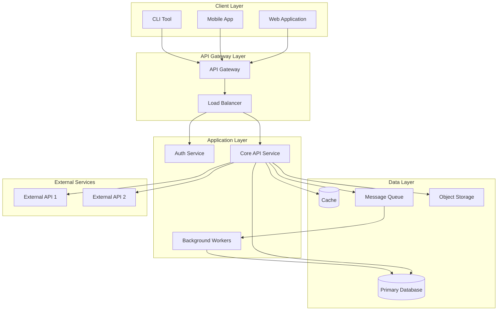

### 5.2 Component Diagram
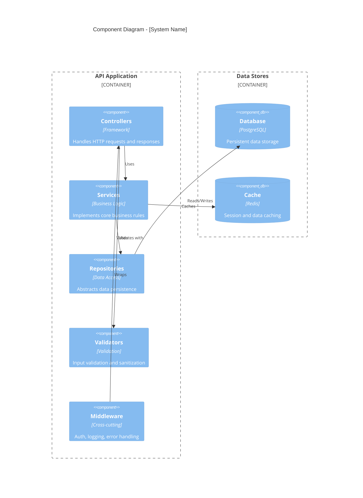

### 5.3 Alternative: Simple Component Diagram
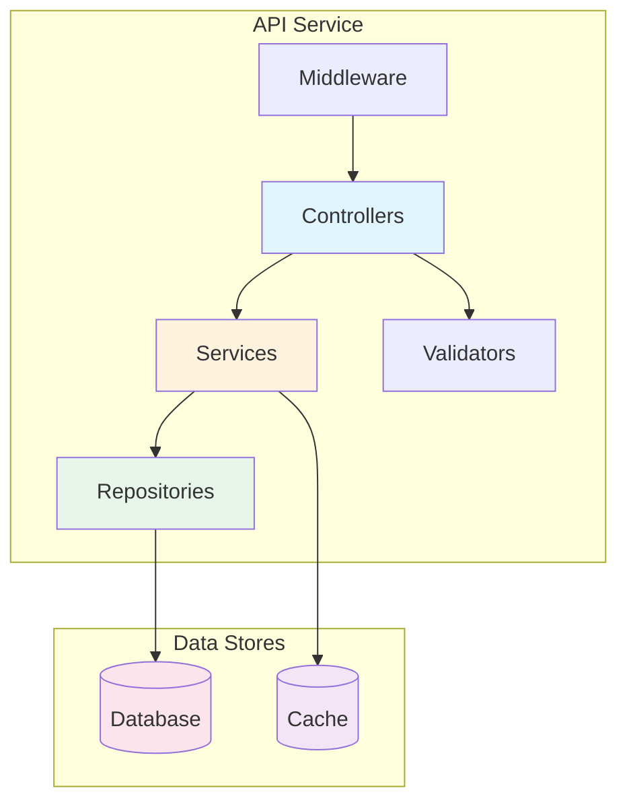

---

## 6. Component Specifications

### 6.1 Component Inventory
| Component | Type | Technology | Owner | Status |
|-----------|------|------------|-------|--------|
| [Component 1] | [Service/Library/Database] | [Tech Stack] | [Team/Person] | [Active/Planned/Deprecated] |
| [Component 2] | [Service/Library/Database] | [Tech Stack] | [Team/Person] | [Active/Planned/Deprecated] |

### 6.2 Component Details

#### Component: [Component Name]
| Attribute | Value |
|-----------|-------|
| **Purpose** | [What this component does] |
| **Technology** | [Tech stack with versions] |
| **Type** | [Service/Library/Database/Queue/etc.] |
| **Deployment** | [How/where it's deployed] |
| **Scaling** | [Horizontal/Vertical/Auto] |

**Responsibilities:**
- [Responsibility 1]
- [Responsibility 2]
- [Responsibility 3]

**Interfaces:**
| Interface | Type | Protocol | Description |
|-----------|------|----------|-------------|
| [Interface 1] | [REST/gRPC/Event] | [HTTP/TCP/AMQP] | [Description] |
| [Interface 2] | [REST/gRPC/Event] | [HTTP/TCP/AMQP] | [Description] |

**Dependencies:**
| Dependency | Type | Required | Purpose |
|------------|------|----------|---------|
| [Service/Library] | [Runtime/Build] | [Yes/No] | [Why needed] |

**Configuration:**
| Parameter | Type | Default | Description |
|-----------|------|---------|-------------|
| [Config 1] | [Type] | [Default] | [Description] |
| [Config 2] | [Type] | [Default] | [Description] |

---

## 7. Data Architecture

### 7.1 Data Flow Diagram
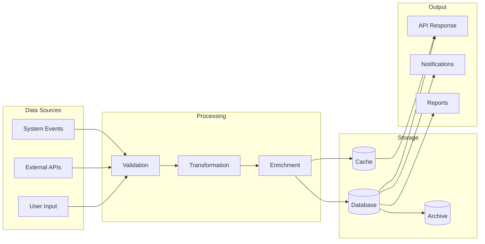

### 7.2 Data Store Mapping
| Data Type | Primary Store | Cache | Archive | Retention |
|-----------|---------------|-------|---------|-----------|
| [User Data] | [PostgreSQL] | [Redis] | [S3] | [X years] |
| [Transaction Data] | [PostgreSQL] | [Redis] | [S3] | [X years] |
| [Session Data] | [Redis] | [N/A] | [N/A] | [X hours] |
| [Audit Logs] | [Elasticsearch] | [N/A] | [S3] | [X years] |

### 7.3 Data Classification
| Classification | Description | Storage Requirements | Access Control |
|----------------|-------------|---------------------|----------------|
| **Public** | Non-sensitive data | Standard | Open |
| **Internal** | Internal business data | Encrypted at rest | Role-based |
| **Confidential** | Sensitive business data | Encrypted at rest & transit | Strict role-based |
| **Restricted** | PII, financial data | Encrypted, audited | Need-to-know basis |

---

## 8. Integration Architecture

### 8.1 Integration Diagram
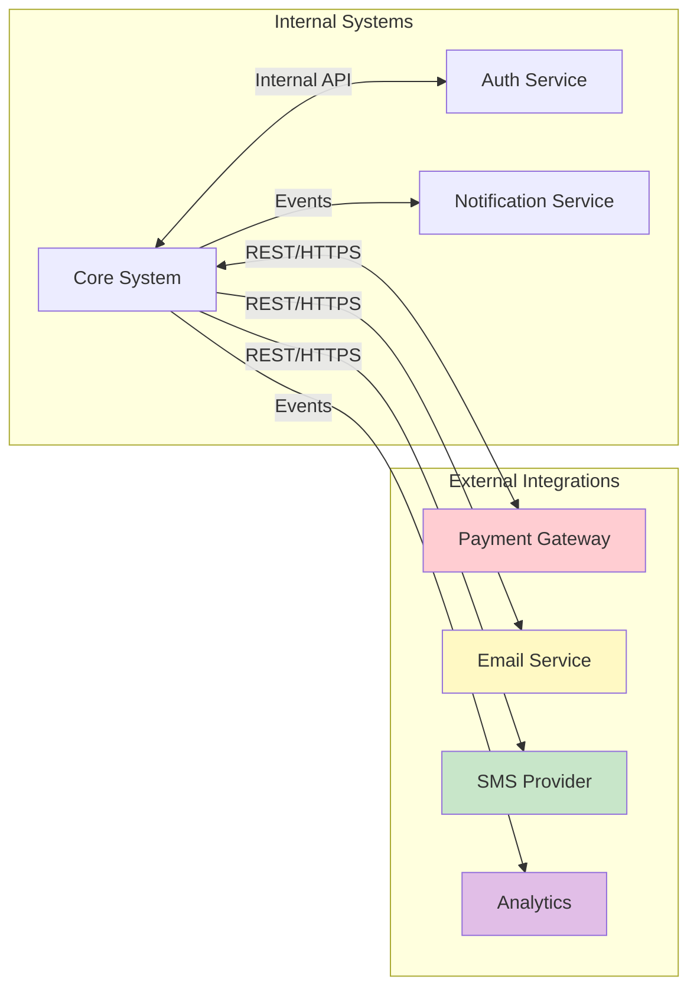

### 8.2 Integration Specifications
| Integration | Type | Protocol | Auth | Rate Limit | Timeout |
|-------------|------|----------|------|------------|---------|
| [Service 1] | [Sync/Async] | [REST/gRPC/WebSocket] | [OAuth2/API Key] | [X/min] | [X sec] |
| [Service 2] | [Sync/Async] | [REST/gRPC/WebSocket] | [OAuth2/API Key] | [X/min] | [X sec] |

### 8.3 API Gateway Configuration
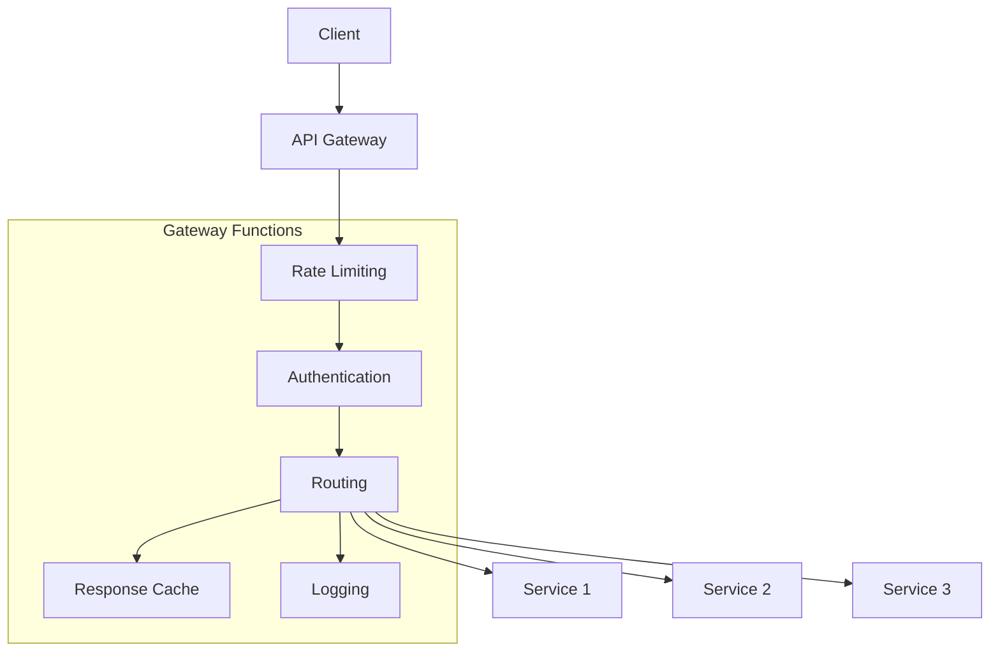

---

## 9. Sequence Diagrams

### 9.1 Authentication Flow
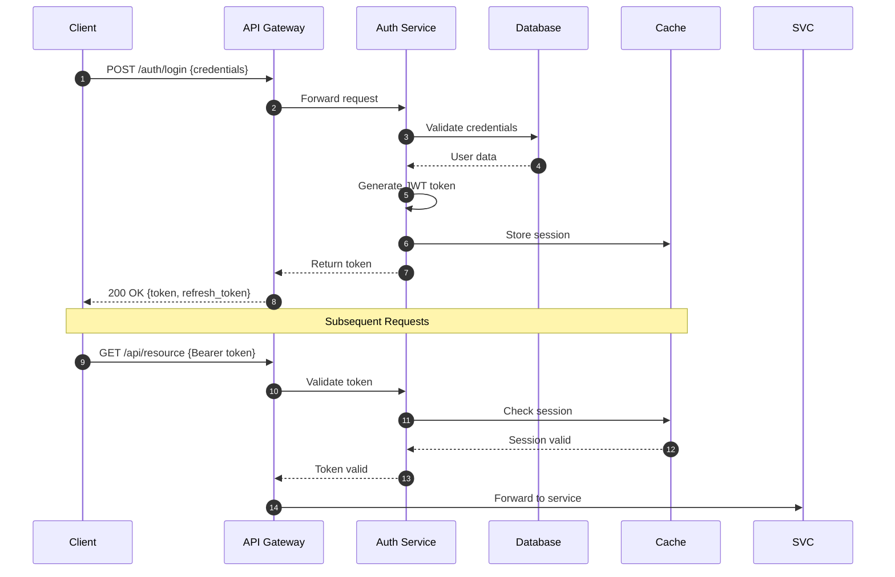

### 9.2 [Key Business Flow Name]
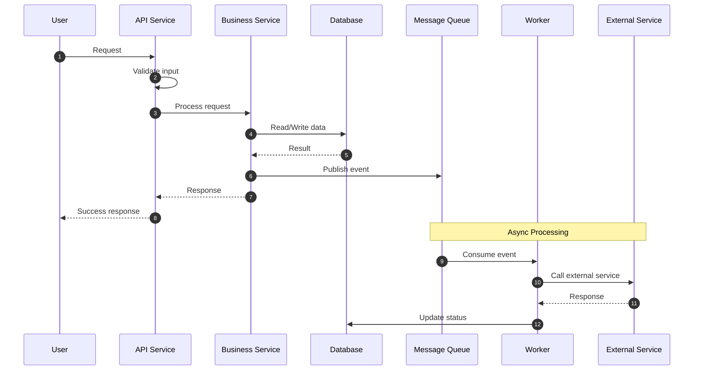

---

## 10. Non-Functional Requirements (NFRs)

### 10.1 Performance Requirements
| Metric | Target | Measurement Method |
|--------|--------|-------------------|
| **API Response Time (p50)** | < [X] ms | [APM tool] |
| **API Response Time (p95)** | < [X] ms | [APM tool] |
| **API Response Time (p99)** | < [X] ms | [APM tool] |
| **Database Query Time (p95)** | < [X] ms | Query logs |
| **Throughput** | [X] req/sec | Load testing |
| **Concurrent Users** | [X] users | Load testing |
| **Page Load Time** | < [X] sec | Browser metrics |
| **Time to First Byte (TTFB)** | < [X] ms | Browser metrics |

### 10.2 Scalability Requirements
| Dimension | Current | Target | Strategy |
|-----------|---------|--------|----------|
| **Users** | [X] | [Y] | [How to scale] |
| **Data Volume** | [X] GB | [Y] TB | [How to scale] |
| **Transactions/Day** | [X] | [Y] | [How to scale] |
| **Geographic Regions** | [X] | [Y] | [How to scale] |

### 10.3 Availability Requirements
| Metric | Target | Notes |
|--------|--------|-------|
| **Uptime SLA** | [99.9%] | [Excluding planned maintenance] |
| **Recovery Time Objective (RTO)** | [X] minutes | [Maximum acceptable downtime] |
| **Recovery Point Objective (RPO)** | [X] minutes | [Maximum data loss window] |
| **Planned Maintenance Window** | [Day/Time] | [Frequency] |

### 10.4 Reliability Requirements
| Requirement | Target | Implementation |
|-------------|--------|----------------|
| **Mean Time Between Failures (MTBF)** | [X] hours | [Strategy] |
| **Mean Time To Recovery (MTTR)** | [X] minutes | [Strategy] |
| **Error Rate** | < [X]% | [Monitoring approach] |
| **Data Durability** | [99.999999999%] | [Storage strategy] |

---

## 11. Security Architecture

### 11.1 Security Layers Diagram
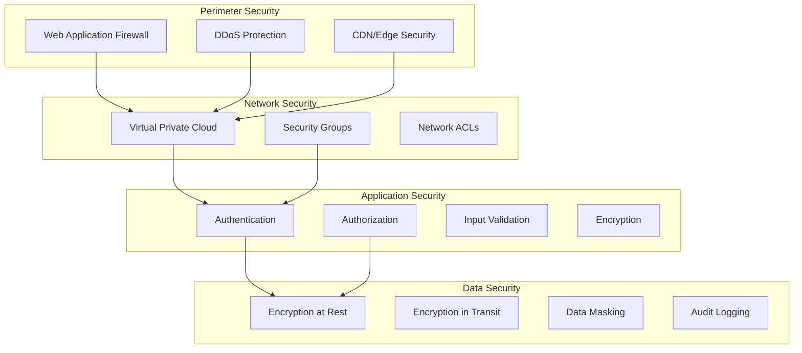

### 11.2 Authentication & Authorization
| Aspect | Implementation | Details |
|--------|----------------|---------|
| **Authentication Method** | [OAuth2/JWT/SAML/etc.] | [Configuration details] |
| **Token Type** | [JWT/Opaque/etc.] | [Expiry: X hours] |
| **Token Storage** | [HttpOnly Cookie/LocalStorage] | [Security considerations] |
| **MFA Support** | [Yes/No] | [Methods supported] |
| **Authorization Model** | [RBAC/ABAC/ACL] | [Implementation details] |
| **Session Management** | [Stateless/Stateful] | [Session timeout: X] |

### 11.3 Security Controls Matrix
| Control | Layer | Implementation | Status |
|---------|-------|----------------|--------|
| **Input Validation** | Application | [Library/Framework] | [Implemented/Planned] |
| **SQL Injection Prevention** | Application | Parameterized queries | [Implemented/Planned] |
| **XSS Prevention** | Application | Output encoding | [Implemented/Planned] |
| **CSRF Protection** | Application | [Token-based/SameSite] | [Implemented/Planned] |
| **Rate Limiting** | Gateway | [X requests/min] | [Implemented/Planned] |
| **TLS/SSL** | Transport | TLS 1.3 | [Implemented/Planned] |
| **Encryption at Rest** | Data | [AES-256] | [Implemented/Planned] |
| **Secrets Management** | Infrastructure | [Vault/AWS Secrets Manager] | [Implemented/Planned] |

### 11.4 Compliance Requirements
| Standard | Requirement | Implementation Status |
|----------|-------------|----------------------|
| [GDPR/HIPAA/SOC2/PCI-DSS] | [Specific requirement] | [Compliant/In Progress/Planned] |

---

## 12. Deployment Architecture

### 12.1 Deployment Diagram
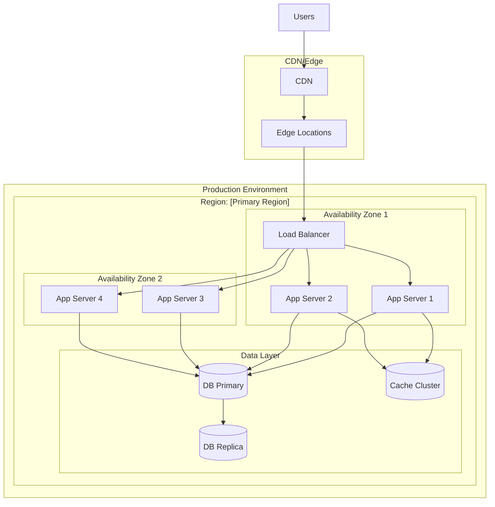

### 12.2 Environment Specifications
| Environment | Purpose | Infrastructure | Access |
|-------------|---------|----------------|--------|
| **Development** | Local development | [Docker/Local] | Developers |
| **Staging** | Pre-production testing | [Cloud specs] | Dev + QA |
| **Production** | Live system | [Cloud specs] | Restricted |

### 12.3 Infrastructure Specifications
| Component | Development | Staging | Production |
|-----------|-------------|---------|------------|
| **App Servers** | 1x [size] | 2x [size] | [X]x [size] + Auto-scaling |
| **Database** | 1x [size] | 1x [size] | Primary + [X] Replicas |
| **Cache** | 1x [size] | 1x [size] | [X]-node cluster |
| **Storage** | [X] GB | [X] GB | [X] TB |

### 12.4 CI/CD Pipeline
```mermaid
graph LR
    subgraph "Source"
        GIT[Git Repository]
    end
    
    subgraph "Build"
        BUILD[Build & Test]
        SCAN[Security Scan]
        LINT[Lint & Analysis]
    end
    
    subgraph "Artifact"
        REGISTRY[Container Registry]
    end
    
    subgraph "Deploy"
        DEV[Development]
        STAGE[Staging]
        PROD[Production]
    end
    
    GIT -->|Push| BUILD
    BUILD --> LINT
    LINT --> SCAN
    SCAN -->|Pass| REGISTRY
    REGISTRY -->|Auto| DEV
    DEV -->|Manual Approval| STAGE
    STAGE -->|Manual Approval| PROD
    
    style PROD fill:#ffcdd2
    style STAGE fill:#fff9c4
    style DEV fill:#c8e6c9
```

---

## 13. Observability

### 13.1 Monitoring Architecture
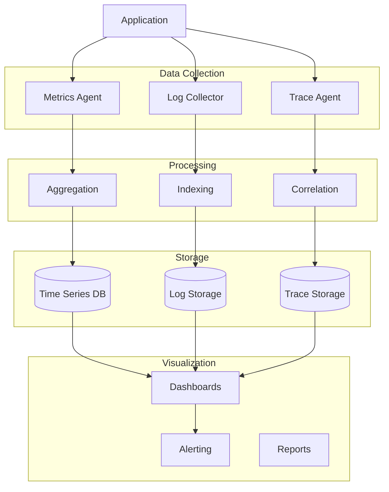

### 13.2 Monitoring Specifications
| Type | Tool | Metrics/Data Collected |
|------|------|----------------------|
| **Infrastructure Monitoring** | [Tool] | CPU, Memory, Disk, Network |
| **Application Monitoring (APM)** | [Tool] | Response times, Error rates, Throughput |
| **Log Management** | [Tool] | Application logs, Access logs, Error logs |
| **Distributed Tracing** | [Tool] | Request traces, Spans, Dependencies |
| **Uptime Monitoring** | [Tool] | Endpoint availability, SSL expiry |
| **Real User Monitoring** | [Tool] | Page load, User interactions, Errors |

### 13.3 Alerting Rules
| Alert | Condition | Severity | Response |
|-------|-----------|----------|----------|
| **High Error Rate** | Error rate > [X]% for [Y] min | Critical | Page on-call |
| **High Latency** | p95 > [X]ms for [Y] min | Warning | Notify team |
| **Database Connection Pool** | Available < [X]% | Critical | Page on-call |
| **Disk Space** | Usage > [X]% | Warning | Notify team |
| **Certificate Expiry** | < [X] days | Warning | Notify team |

### 13.4 Logging Standards
| Field | Required | Format | Example |
|-------|----------|--------|---------|
| **timestamp** | Yes | ISO 8601 | `2024-01-15T10:30:00.000Z` |
| **level** | Yes | String | `INFO`, `WARN`, `ERROR` |
| **service** | Yes | String | `api-service` |
| **trace_id** | Yes | UUID | `550e8400-e29b-41d4-a716-446655440000` |
| **message** | Yes | String | Human-readable message |
| **context** | No | Object | Additional structured data |

---

## 14. Disaster Recovery

### 14.1 Backup Strategy
| Data Type | Backup Frequency | Retention | Storage Location |
|-----------|------------------|-----------|------------------|
| **Database** | [Continuous/Daily/Hourly] | [X days/months] | [Location] |
| **File Storage** | [Daily/Weekly] | [X days/months] | [Location] |
| **Configuration** | [On change] | [Indefinite] | [Version control] |
| **Secrets** | [On change] | [X versions] | [Secrets manager] |

### 14.2 Recovery Procedures
| Scenario | RTO | RPO | Procedure |
|----------|-----|-----|-----------|
| **Database Failure** | [X] min | [X] min | [High-level steps] |
| **Application Failure** | [X] min | [X] min | [High-level steps] |
| **Region Failure** | [X] hours | [X] min | [High-level steps] |
| **Data Corruption** | [X] hours | [X] min | [High-level steps] |

### 14.3 Disaster Recovery Diagram
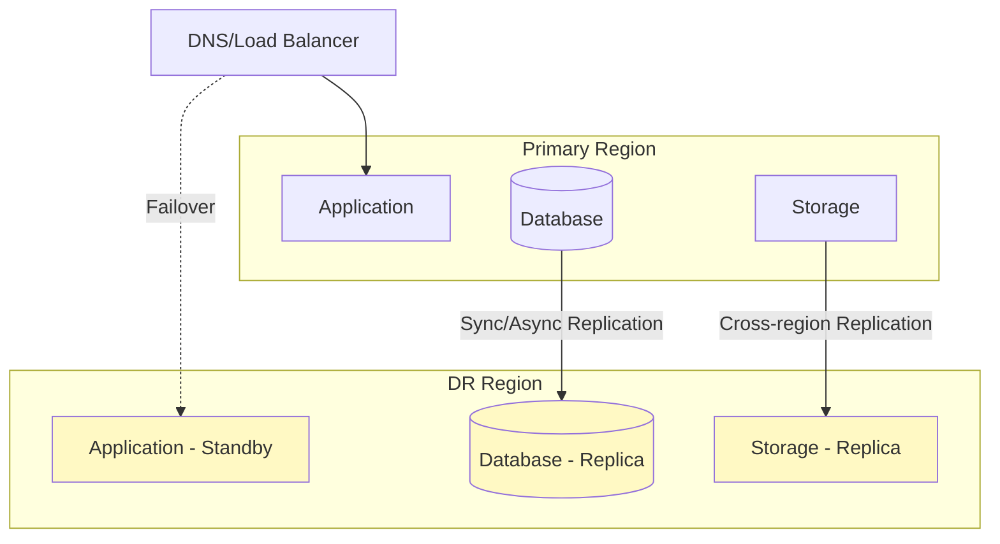

---

## 15. Architecture Decisions

### 15.1 Architecture Decision Records (ADRs)

#### ADR-001: [Decision Title]
| Field | Value |
|-------|-------|
| **Status** | [Proposed/Accepted/Deprecated/Superseded] |
| **Date** | [YYYY-MM-DD] |
| **Deciders** | [List of people involved] |

**Context:**
[What is the issue that we're seeing that is motivating this decision?]

**Decision:**
[What is the change that we're proposing and/or doing?]

**Consequences:**
- **Positive:** [What becomes easier?]
- **Negative:** [What becomes harder?]
- **Risks:** [What risks are introduced?]

**Alternatives Considered:**
| Alternative | Pros | Cons | Why Not Chosen |
|-------------|------|------|----------------|
| [Alternative 1] | [Pros] | [Cons] | [Reason] |
| [Alternative 2] | [Pros] | [Cons] | [Reason] |

---

## 16. Glossary

| Term | Definition |
|------|------------|
| [Term 1] | [Definition] |
| [Term 2] | [Definition] |
| [Term 3] | [Definition] |

---

## 17. References

| Reference | Link | Description |
|-----------|------|-------------|
| [Reference 1] | [URL] | [Description] |
| [Reference 2] | [URL] | [Description] |

---

## 18. Appendices

### Appendix A: Detailed Component Specifications
[Additional detailed specifications if needed]

### Appendix B: Network Diagrams
[Additional network architecture diagrams if needed]

### Appendix C: Compliance Documentation
[Compliance-related documentation if needed]

---

## Document History

| Version | Date | Author | Changes |
|---------|------|--------|---------|
| 1.0.0 | [Date] | [Author] | Initial version |
| [X.Y.Z] | [Date] | [Author] | [Changes] |
