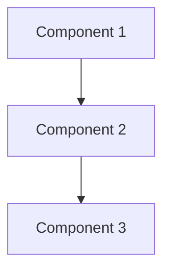
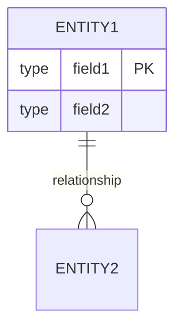

# Project Specification Template

## 0. Contract Validation Rules
**MANDATORY**: All fields marked with [REQUIRED] must be completed before implementation begins.

### 0.1 Required Field Definitions
- **Project Name**: [REQUIRED] String, 3-50 characters, alphanumeric + hyphens/underscores
- **Version**: [REQUIRED] Semantic versioning format (e.g., 1.0.0)
- **Technical Stack**: [REQUIRED] All components must be specified with versions
- **Interface Design**: [REQUIRED] All interfaces (API endpoints, mobile screens, CLI commands, library functions) must have complete specifications
- **Data Model**: [REQUIRED] All entities must have complete field definitions
- **Acceptance Criteria**: [REQUIRED] All criteria must be testable and measurable

### 0.2 Validation Checklist
Before implementation begins, verify:
- [ ] All [REQUIRED] fields in sections 1-12 are completed
- [ ] All interfaces have complete specifications (API endpoints, mobile screens, CLI commands, etc.)
- [ ] All data models have complete schemas
- [ ] All acceptance criteria are testable
- [ ] Technical stack versions are specified
- [ ] Performance benchmarks are measurable
- [ ] Security requirements are explicit

## 1. Project Overview
**Name**: [REQUIRED] [Project Name]
**Version**: [REQUIRED] [Version Number - Semantic versioning]
**Date**: [REQUIRED] [Date - ISO 8601 format]
**Author**: [REQUIRED] [Author/Team]

## 2. Objectives
- [Objective 1]
- [Objective 2]
- [Objective 3]

## 3. Requirements

### 3.1 Functional Requirements
1. [Requirement 1]
   - [Sub-requirement]
2. [Requirement 2]
   - [Sub-requirement]

### 3.2 Non-Functional Requirements
- **Performance**: 
  - API response time: < [X]ms (p95 percentile)
  - Database query time: < [X]ms (p95 percentile)
  - Throughput: [X] requests/second
  - Concurrent users: [X] users
- **Security**: 
  - Authentication: [REQUIRED] [OAuth2/JWT/Basic Auth/etc.]
  - Encryption: [REQUIRED] [TLS version, at-rest encryption requirements]
  - Compliance: [GDPR/HIPAA/SOC2/etc. if applicable]
  - Input validation: [REQUIRED] All user inputs must be validated
  - Secrets management: [REQUIRED] No secrets in code, use [environment variables/secret manager]
- **Scalability**: 
  - Horizontal scaling: [Yes/No]
  - Expected load: [X] concurrent users
  - Auto-scaling rules: [Define triggers and thresholds]
  - Database scaling: [Vertical/Horizontal/Read replicas]
- **Maintainability**: 
  - Code coverage: ≥ [X]% (minimum threshold)
  - Documentation: [REQUIRED] All functions/classes must have docstrings
  - Linting: [REQUIRED] All code must pass [linter name] with [config file]
  - Type hints: [REQUIRED] All functions must have type hints/annotations

## 4. Technical Stack
**MANDATORY**: All components must specify exact versions. Prefer latest stable versions (search the web).

- **Language**: [REQUIRED] [Language] [Version]
- **Framework**: [REQUIRED] [Framework] [Version]
- **Database**: [REQUIRED] [Database] [Version]
- **Infrastructure**: [REQUIRED] [Infrastructure/Cloud Provider] [Version/Region]
- **Additional Dependencies**: [List key dependencies with versions]

## 5. Architecture
[High-level architecture description and/or diagram]

### 5.1 Core Components
- [Component 1]
- [Component 2]
- [Component 3]

### 5.2 Components Diagram


### 5.3 Data Flow
[Description of data flow between components]

## 6. Interface Design

### 6.1 Interface Type
**MANDATORY**: Specify the primary interface type(s) for this application:
- [ ] HTTP REST API
- [ ] GraphQL API
- [ ] Mobile Application (iOS/Android)
- [ ] Desktop Application
- [ ] CLI (Command Line Interface)
- [ ] Library/Package Interface
- [ ] Web Application (Frontend)
- [ ] Other: [Specify]

### 6.2 General Interface Contract Requirements
**MANDATORY**: Each interface/endpoint/function MUST specify:
- Interface Name/Path/Function Signature
- Input Schema/Parameters (data types, constraints, validation rules)
- Output Schema/Return Type (success response format)
- Error Handling (error types, error format - see Section 15)
- Authentication/Authorization Requirements (if applicable)
- Rate Limiting/Throttling Rules (if applicable)

### 6.3 HTTP REST API Specifications
**If applicable**: For HTTP REST APIs, provide the following:

#### 6.3.1 API Base Information
- **Base URL**: [REQUIRED] [e.g., https://api.example.com/v1]
- **API Version**: [REQUIRED] [e.g., v1]
- **Authentication**: [REQUIRED] [OAuth2/JWT/Basic Auth/etc.]
- **Content-Type**: [application/json]
- **Rate Limiting**: [X requests per minute/hour]

#### 6.3.2 Endpoint Specifications
For each endpoint, provide the following:

##### Endpoint: [METHOD] /api/v1/[resource]
- **Description**: [What this endpoint does]
- **Authentication**: [Required/Optional]
- **Request Schema**: 
  ```json
  {
    "field1": "type",
    "field2": "type"
  }
  ```
- **Request Validation Rules**: [Field-level validation requirements]
- **Response Schema (Success)**: 
  ```json
  {
    "data": {},
    "meta": {}
  }
  ```
- **HTTP Status Codes**: 
  - 200: Success
  - 400: Bad Request
  - 401: Unauthorized
  - 404: Not Found
  - 500: Internal Server Error
- **Error Response Format**: [See Section 15 for standard error format]
- **Example Request**: [cURL or example JSON]
- **Example Response**: [Example JSON]

### 6.4 Mobile Application Interface Specifications
**If applicable**: For mobile applications (iOS/Swift, Android, etc.), provide:

#### 6.4.1 Screen/View Specifications
For each screen/view, provide:
- **Screen Name**: [REQUIRED] [e.g., LoginScreen, HomeView]
- **Purpose**: [What this screen does]
- **Navigation**: [How to reach this screen]
- **UI Components**: [List of UI elements and their behavior]
- **Data Requirements**: [What data this screen needs]
- **User Interactions**: [Actions users can perform]
- **Error States**: [How errors are displayed - see Section 15]

#### 6.4.2 Service/API Layer Specifications
- **Service Methods**: [List of service methods with signatures]
- **Data Models**: [Swift structs/classes, Kotlin data classes, etc.]
- **Error Handling**: [How errors are handled - see Section 15]
- **Network Configuration**: [Base URLs, timeouts, retry logic]

### 6.5 CLI Interface Specifications
**If applicable**: For command-line interfaces, provide:

#### 6.5.1 Command Specifications
For each command, provide:
- **Command**: [REQUIRED] [e.g., `app create --name <name>`]
- **Description**: [What this command does]
- **Arguments**: [Positional arguments]
- **Options/Flags**: [Optional parameters]
- **Exit Codes**: [0 = success, non-zero = error - see Section 15]
- **Example Usage**: [Example command with output]

### 6.6 Library/Package Interface Specifications
**If applicable**: For libraries or packages, provide:

#### 6.6.1 Public API Specifications
- **Exported Functions/Classes**: [List with signatures]
- **Input/Output Types**: [Type definitions]
- **Error Types**: [Custom error types - see Section 15]
- **Usage Examples**: [Code examples]

### 6.7 Interface Documentation Requirements
**MANDATORY**: Based on interface type, provide appropriate documentation:
- **HTTP REST API**: [REQUIRED] OpenAPI/Swagger specification (YAML format) in API.md
- **GraphQL API**: [REQUIRED] GraphQL schema and documentation in API.md
- **Mobile App**: [REQUIRED] Screen flow diagrams, component specifications in INTERFACE.md
- **CLI**: [REQUIRED] Command reference and usage examples in INTERFACE.md
- **Library**: [REQUIRED] API reference and usage examples in INTERFACE.md
- **All Types**: [REQUIRED] All interfaces documented with complete schemas/signatures
- **All Types**: [REQUIRED] Authentication flows documented (if applicable)
- **All Types**: [REQUIRED] Example usage for each interface

## 7. Data Model

### 7.1 Database Schema Requirements
**MANDATORY**: Each entity MUST specify:
- Table/Collection Name
- Field Definitions (name, type, constraints, default values)
- Primary Keys
- Foreign Keys and Relationships
- Indexes (for performance)
- Validation Rules (business logic constraints)

### 7.2 Entity Definitions
For each entity, provide the following:

#### Entity: [EntityName]
- **Table/Collection Name**: [REQUIRED] [name]
- **Description**: [What this entity represents]
- **Fields**: 
  | Field Name | Type | Constraints | Default | Description |
  |------------|------|-------------|---------|-------------|
  | id | [type] | PRIMARY KEY, NOT NULL | [default] | [description] |
  | field1 | [type] | [constraints] | [default] | [description] |
  | field2 | [type] | [constraints] | [default] | [description] |
- **Primary Key**: [field name(s)]
- **Foreign Keys**: 
  - [field_name] → [referenced_table].[referenced_field]
- **Indexes**: 
  - [index_name] on [field(s)] for [purpose]
- **Validation Rules**: 
  - [Business rule 1]
  - [Business rule 2]
- **Relationships**: 
  - [One-to-One/One-to-Many/Many-to-Many] with [EntityName]

### 7.3 Data Model Diagram
**MANDATORY**: Include ERD diagram in Mermaid format:


### 7.4 Data Migration Requirements
- [ ] Initial schema migration script
- [ ] Seed data script (if applicable)
- [ ] Migration rollback strategy

## 8. User Stories
1. As a [user type], I want [goal] so that [benefit]
2. As a [user type], I want [goal] so that [benefit]

## 9. Acceptance Criteria
- [ ] [Criterion 1]
- [ ] [Criterion 2]
- [ ] [Criterion 3]

## 10. Timeline
- [Phase 1]: [Dates]
- [Phase 2]: [Dates]
- [Phase 3]: [Dates]

## 11. Risks and Mitigation
- **Risk**: [Description]
  - **Mitigation**: [Strategy]

## 12. Success Metrics
- [Metric 1]
- [Metric 2]
- [Metric 3]

## 13. Documentation and Progress Tracking

### 13.1 Required Documentation Files
**MANDATORY**: The following files MUST be created and maintained in the `docs/` directory:

#### spec.md
- Complete specification based on this template
- All [REQUIRED] fields must be filled
- All placeholders must be replaced with actual values
- Serves as the contract for the AI agent implementing this application

#### IMPLEMENTATION_STATUS.md
**MANDATORY FORMAT**:
```markdown
# Implementation Status

## Overall Status
- **Status**: [NOT_STARTED | IN_PROGRESS | COMPLETED | BLOCKED]
- **Progress**: [X]% complete
- **Last Updated**: [ISO 8601 timestamp: YYYY-MM-DDTHH:MM:SSZ]
- **Started**: [ISO 8601 timestamp]
- **Completed**: [ISO 8601 timestamp or N/A]

## Current Phase
[Phase name or description]

## Completed Components
- [ ] Component 1
- [ ] Component 2

## In Progress
- [Component name]: [Description of current work]

## Next Steps
1. [Explicit action item 1]
2. [Explicit action item 2]
3. [Explicit action item 3]

## Blockers
- [Blocker 1]: [Description and resolution plan]
- [Blocker 2]: [Description and resolution plan]

## Notes
[Any additional notes or observations]
```

#### API.md (for HTTP REST/GraphQL APIs)
**MANDATORY CONTENT** (if application includes HTTP APIs):
- OpenAPI/Swagger specification (YAML format) for REST APIs
- GraphQL schema and documentation (if using GraphQL)
- All endpoints/queries with complete request/response schemas
- Authentication flows and examples
- Example requests/responses for each endpoint
- Error codes and their meanings (see Section 15)
- Rate limiting information

#### INTERFACE.md (for Mobile Apps, CLI, Libraries, etc.)
**MANDATORY CONTENT** (if application includes non-HTTP interfaces):
- **Mobile Apps**: Screen flow diagrams, component specifications, service method signatures, data models
- **CLI**: Command reference, usage examples, exit codes, error messages
- **Libraries**: Public API reference, function/class signatures, error types, usage examples
- **Desktop Apps**: UI component specifications, event handling, data flow
- All interfaces documented with complete schemas/signatures
- Error handling documentation (see Section 15)

#### ARCHITECTURE.md
**MANDATORY CONTENT**:
- Component diagrams (Mermaid format)
- Data flow diagrams
- Sequence diagrams for key flows
- Technology decisions and rationale
- Deployment architecture
- Infrastructure diagrams

#### DATA_MODEL.md
**MANDATORY CONTENT**:
- ERD diagram (Mermaid format)
- Table/collection schemas with all fields
- Relationship definitions
- Index definitions
- Migration scripts (if applicable)
- Seed data structure (if applicable)

## 14. Implementation Constraints
**MANDATORY**: The AI agent MUST adhere to the following constraints:

### 14.1 Code Quality Standards
- [ ] All code MUST pass linting (specify linter: [linter name] with config: [config file])
- [ ] Code coverage MUST be ≥ [X]% (specify minimum threshold)
- [ ] All functions/classes MUST have docstrings/type hints
- [ ] No hardcoded values (use configuration/environment variables)
- [ ] No commented-out code in production
- [ ] All magic numbers must be constants

### 14.2 Testing Requirements
- [ ] Unit tests for all business logic
- [ ] Integration tests for all API endpoints
- [ ] Test data MUST be isolated (no production data)
- [ ] Tests MUST be deterministic (no flaky tests)
- [ ] Test fixtures MUST be reusable
- [ ] All tests MUST have clear descriptions

### 14.3 Security Requirements
- [ ] Input validation on all user inputs
- [ ] Authentication/Authorization on all protected endpoints
- [ ] Secrets management (no secrets in code, use [method])
- [ ] SQL injection prevention (parameterized queries)
- [ ] XSS prevention (output encoding)
- [ ] CSRF protection (if applicable)
- [ ] Rate limiting implementation
- [ ] Security headers (CORS, CSP, etc.)

### 14.4 Error Handling Requirements
- [ ] All errors MUST follow the error handling contract (see Section 15)
- [ ] No sensitive information in error messages (passwords, tokens, internal paths, etc.)
- [ ] Proper logging of errors (with appropriate log levels)
- [ ] Error types/codes MUST be documented (in API.md, INTERFACE.md, or appropriate documentation)
- [ ] User-facing errors MUST be user-friendly and actionable
- [ ] Developer-facing errors MUST include sufficient context for debugging
- [ ] Error handling MUST be consistent across all interfaces (API, mobile, CLI, etc.)

## 15. Error Handling Contract
**MANDATORY**: All errors MUST follow a consistent structure appropriate to the interface type.

### 15.1 General Error Structure
All errors MUST include:
- **Error Code/Type**: [REQUIRED] Unique identifier for the error type
- **Error Message**: [REQUIRED] Human-readable message (user-friendly for user-facing errors)
- **Error Details**: [Optional] Additional context (avoid sensitive information)
- **Timestamp**: [REQUIRED] ISO 8601 format timestamp
- **Context ID**: [REQUIRED] Request ID, session ID, or transaction ID for tracking

### 15.2 HTTP REST API Error Format
**For HTTP REST APIs**, errors MUST follow this JSON structure:
```json
{
  "error": {
    "code": "ERROR_CODE",
    "message": "Human-readable message",
    "details": {},
    "timestamp": "ISO 8601 format",
    "request_id": "UUID for request tracking"
  }
}
```

**HTTP Status Code Standards**:
- **4XX Errors**: Client errors (validation, authentication, authorization)
  - 400: Bad Request (validation errors)
  - 401: Unauthorized (authentication required)
  - 403: Forbidden (authorization failed)
  - 404: Not Found
  - 409: Conflict (resource conflict)
  - 422: Unprocessable Entity (validation failed)
- **5XX Errors**: Server errors (internal, database, external service)
  - 500: Internal Server Error
  - 502: Bad Gateway
  - 503: Service Unavailable

### 15.3 Mobile Application Error Format
**For mobile applications** (iOS/Swift, Android, etc.), errors MUST follow platform conventions:

#### 15.3.1 iOS/Swift Error Handling
- **Error Types**: Use Swift `Error` protocol with custom error enums
- **Error Structure**:
  ```swift
  enum AppError: Error {
      case validationError(message: String, field: String?)
      case networkError(code: Int, message: String)
      case authenticationError(message: String)
      case notFound(resource: String)
      case serverError(message: String)
  }
  ```
- **User Display**: Present user-friendly messages via UI alerts/toasts
- **Logging**: Log full error details (including stack traces) for debugging

#### 15.3.2 Android Error Handling
- **Error Types**: Use custom exceptions or sealed classes
- **Error Structure**: Similar to Swift, adapted for Kotlin/Java conventions
- **User Display**: Present via Snackbar, Toast, or AlertDialog
- **Logging**: Log full error details with appropriate log levels

### 15.4 CLI Error Format
**For command-line interfaces**, errors MUST follow:
- **Exit Codes**: 
  - 0: Success
  - 1: General error
  - 2: Misuse of shell command
  - 3-125: Application-specific errors (document each)
  - 126-255: Reserved for system errors
- **Error Messages**: Print to stderr in format:
  ```
  Error: [ERROR_CODE] - [Human-readable message]
  Details: [Additional context if needed]
  ```
- **Help Text**: Include `--help` flag that documents all error codes

### 15.5 Library/Package Error Format
**For libraries and packages**, errors MUST:
- **Error Types**: Use language-appropriate error types (exceptions, error enums, Result types)
- **Error Documentation**: Document all possible error types in API documentation
- **Error Messages**: Provide clear, actionable error messages
- **Error Context**: Include sufficient context for debugging

### 15.6 Error Code Standards
**MANDATORY**: Error codes MUST be:
- **Unique**: Each error code must be unique within the application
- **Categorized**: Group related errors (e.g., VALIDATION_*, AUTH_*, NETWORK_*)
- **Documented**: All error codes MUST be documented with:
  - Code identifier
  - Description
  - When it occurs
  - How to resolve (if applicable)
- **Consistent**: Same error type must use same code across all interfaces

### 15.7 Error Message Standards
**MANDATORY**: Error messages MUST:
- **User-Friendly**: For user-facing errors, use clear, non-technical language
- **Actionable**: Tell users what they can do to resolve the error
- **Secure**: NEVER expose sensitive information (passwords, tokens, database structure, internal paths, stack traces to users)
- **Contextual**: Include relevant context (which field failed, what resource was not found, etc.)

### 15.8 Logging Requirements
- [ ] All errors MUST be logged with appropriate log level (ERROR, WARN, etc.)
- [ ] Logs MUST include: timestamp, context_id, error code, error message
- [ ] For debugging: Include stack traces for unexpected errors (5XX, internal errors)
- [ ] Sensitive data MUST NOT be logged (passwords, tokens, PII, credit card numbers)
- [ ] Log format: [Specify format: JSON/structured/text/etc.]
- [ ] Log retention: [Specify retention policy]

### 15.9 Error Documentation Requirements
- [ ] All error codes/types MUST be documented in appropriate documentation file
- [ ] HTTP APIs: Document in API.md
- [ ] Mobile Apps: Document in INTERFACE.md or API.md
- [ ] CLI: Document in INTERFACE.md or help text
- [ ] Libraries: Document in API reference documentation

## 16. Version Control and Git Requirements
**MANDATORY**: The following version control practices MUST be followed:

### 16.1 Commit Message Format
- Commit messages MUST follow [Conventional Commits](https://www.conventionalcommits.org/) format:
  ```
  <type>(<scope>): <subject>
  
  <body>
  
  <footer>
  ```
- Types: `feat`, `fix`, `docs`, `style`, `refactor`, `test`, `chore`
- Examples:
  - `feat(api): add user authentication endpoint`
  - `fix(database): resolve connection pool issue`
  - `test(auth): add unit tests for JWT validation`

### 16.2 Branch Naming
- Format: `[type]/[description]`
- Types: `feature`, `fix`, `refactor`, `hotfix`
- Examples: `feature/user-authentication`, `fix/login-bug`

### 16.3 Commit Requirements
- [ ] All commits MUST be atomic (one logical change per commit)
- [ ] Commits MUST be small and focused
- [ ] No commits with "WIP" or temporary code
- [ ] All commits MUST pass tests

### 16.4 Pull Request Requirements
Pull requests MUST include:
- [ ] Description of changes
- [ ] Link to related issue/spec section
- [ ] Test coverage information
- [ ] Screenshots (if UI changes)
- [ ] Checklist of completed requirements

## 17. Dependency Management
**MANDATORY**: The following dependency management practices MUST be followed:

### 17.1 Dependency Requirements
- [ ] All dependencies MUST be pinned to specific versions
- [ ] Dependency file MUST be included (package.json, requirements.txt, Pipfile, etc.)
- [ ] Security vulnerabilities MUST be addressed (use [tool name] for scanning)
- [ ] License compatibility MUST be verified
- [ ] Dependency updates MUST be tested before merging

### 17.2 Dependency Files
- [ ] Lock file MUST be committed (package-lock.json, Pipfile.lock, etc.)
- [ ] Development dependencies MUST be separated from production dependencies
- [ ] Dependency versions MUST be reviewed regularly

## 18. AI Agent Implementation Instructions
**MANDATORY**: The AI agent MUST follow these instructions:

### 18.1 Before Starting Implementation
1. **Read and Understand**:
   - [ ] Read ALL sections of this spec completely
   - [ ] Verify all [REQUIRED] fields are present and completed
   - [ ] Understand all constraints in Section 14
   - [ ] Review all acceptance criteria in Section 9

2. **Initial Setup**:
   - [ ] Create IMPLEMENTATION_STATUS.md with initial state (NOT_STARTED)
   - [ ] Set up project structure according to architecture
   - [ ] Initialize version control repository
   - [ ] Set up development environment (linting, testing, etc.)

### 18.2 During Implementation
1. **Development Process**:
   - [ ] Follow Test-Driven Development (TDD) approach
   - [ ] Create tests alongside code (not after)
   - [ ] Update IMPLEMENTATION_STATUS.md after each major milestone
   - [ ] Follow all constraints in Section 14
   - [ ] Make atomic commits following Section 16 guidelines

2. **Documentation**:
   - [ ] Update API.md as HTTP API endpoints are implemented (if applicable)
   - [ ] Update INTERFACE.md as interfaces are implemented (mobile screens, CLI commands, library functions, etc.)
   - [ ] Update ARCHITECTURE.md if architecture changes
   - [ ] Update DATA_MODEL.md as data models are defined
   - [ ] Document any deviations from spec with rationale

3. **Quality Assurance**:
   - [ ] Run linter before each commit
   - [ ] Ensure all tests pass
   - [ ] Verify code coverage meets requirements
   - [ ] Check for security vulnerabilities

### 18.3 After Completion
1. **Final Verification**:
   - [ ] Verify all acceptance criteria are met (Section 9)
   - [ ] Ensure all documentation is complete (Section 13)
   - [ ] Run all tests and verify coverage ≥ threshold
   - [ ] Perform security audit
   - [ ] Update IMPLEMENTATION_STATUS.md to COMPLETED

2. **Documentation Review**:
   - [ ] All required documentation files are present
   - [ ] All documentation is accurate and up-to-date
   - [ ] API.md includes complete OpenAPI specification (if HTTP APIs are used)
   - [ ] INTERFACE.md includes complete interface specifications (if non-HTTP interfaces are used)
   - [ ] All diagrams are included and accurate

3. **Final Checklist**:
   - [ ] All [REQUIRED] fields in spec are implemented
   - [ ] All error handling follows Section 15 format
   - [ ] All dependencies are properly managed (Section 17)
   - [ ] All commits follow Section 16 guidelines
   - [ ] Code passes all quality standards (Section 14.1)

## 19. Appendices
- [Additional information, diagrams, references, etc.]